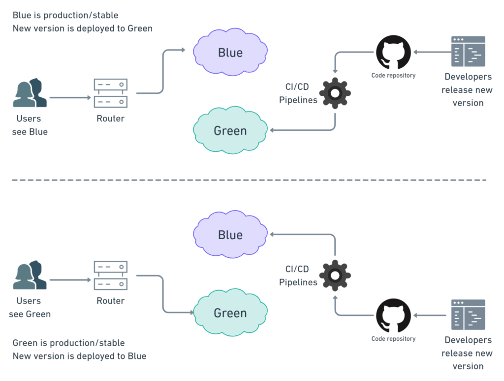
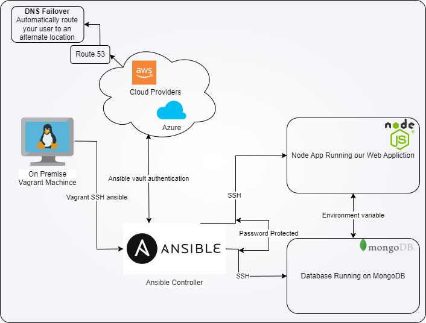

# Ansible and IaC

## Blue and Green Deployment



A blue/green deployment is a deployment strategy in which you create two separate, but identical environments. You then switch between the two environments, one at a time. This strategy is also known as a two-tier deployment.

Green is the new environment, and blue is the old environment. The new environment is created and tested before it is switched to. The old environment is then decommissioned.

### Benefits of Blue/Green Deployment

* You can test new features in a production-like environment before you deploy them to production.
* You can deploy new features to a small subset of users before you deploy them to all users.
* You can roll back to the previous environment if the new environment is not working as expected.

### Drawbacks of Blue/Green Deployment

* You need to maintain two environments, which can be expensive.
* You need to switch between the two environments, which can be time-consuming.

## Iac with Ansible



### What is IaC?

Infrastructure as Code (IaC) is the process of managing and provisioning computer data centers through machine-readable definition files, rather than physical hardware configuration or interactive configuration tools.

#### Benefits of IaC

* You can automate the provisioning of your infrastructure.
* You can version control your infrastructure.
* You can test your infrastructure.
* You can automate the deployment of your infrastructure.

## Ansible

### What is Ansible?

Ansible is an open-source software provisioning, configuration management, and application-deployment tool enabling infrastructure as code. It runs on many Unix-like systems, and can configure both Unix-like systems as well as Microsoft Windows.

### Benifits Ansible?

* **Agentless** - Ansible does not require any software to be installed on remote nodes. It uses SSH (or other remote communication protocols) for communication and does not leave any software or services running on remote nodes.

* **Easy to use** - Ansible is easy to use and does not require any special knowledge of the remote systems. It uses YAML for describing the automation jobs.

### IaC configuration Management

* **Configuration Management** - Ansible models your IT infrastructure by describing how all of your systems inter-relate, rather than just managing one system at a time. It tracks and manages changes, and can roll them back as needed.

### What is inventory?

An inventory is a list of hosts that Ansible manages. It is a simple text file that contains a list of hosts, one per line. It can also contain groups of hosts, and variables that apply to those hosts.

### What is Roles?

A role is a set of Ansible tasks, handlers, and variables that are used together. Roles are a way of automatically loading related vars_files, tasks, and handlers together. Roles can be shared and reused.

### What is Playbook?

A playbook is a list of tasks to be executed on a remote host. Playbooks are written in YAML format and have a simple structure that allows you to easily organize your automation jobs into logical groups.

### Setup

Detailed instructions are available in the [AnsibleSetup.md](AnsibleSetup.md) file.

### Adhoc Commands

```bash
ansible all -a "uname -a"
ansible all -m ping     # ping all hosts
ansible web -m ping     # ping web hosts
ansible db -m ping      # ping db hosts
ansible all -a "free"   # Find free memory 
```

### Copy files

```bash
ansible all -m copy -a "src=/etc/hosts dest=/home/vagrant"
ansible all -m copy -a "src=/etc/hosts dest=/tmp/hosts owner=vagrant group=vagrant mode=0644" # copy with permissions
```

## YAML

### What is YAML?

YAML is a human-readable data serialization language. It is commonly used for configuration files and in applications where data is being stored or transmitted.

### YAML Syntax

* YAML is case sensitive.
* YAML uses indentation to represent scope.
* YAML uses three dashes (---) to indicate the start of a document, and three dots (...) to indicate the end of a document.
* YAML supports two data structures: hashes and arrays.

### Configuration Ngix with Ansible using YAML

create a file called `nginx.yml` and add the following content

```yaml
---

- hosts: web

  gather_facts: yes
  become: true
  tasks:
    - name: Install Nginx in Web Server
      apt: pkg=nginx state=present # could be absent to remove the package
```

### Start Playbooks

```bash
sudo ansible-playbook nginx.yml
sudo ansible-playbook nginx.yml -vvv # verbose
sudo ansible-playbook nginx.yml --check # check mode
```

### Check if Nginx is installed

```bash
sudo ansible web -a "sudo systemctl status nginx"
```

### Install nodejs

```yaml
---
- hosts: web
  gather_facts: yes
  become: true
  tasks:
  - name: Install nodejs
    apt: pkg=nodejs state=present

  - name: Install NPM
    apt: pkg=npm state=present
```

### Check if nodejs is installed

```bash
sudo ansible web -a "node -v"
sudo ansible web -a "npm -v"
```

### Install MongoDB

```yaml
---
- hosts: db
  gather_facts: yes
  become: true
  tasks:
    - name: Install MongoDB
      apt: pkg=mongodb state=present
```

### Check if MongoDB is installed

```bash
sudo ansible db -a "sudo systemctl status mongodb"
```

## Hybrid Setup

### Pre-requisites

* Need to intsall `python 3` - `sudo apt install python3`
* Need to install `pip3` - `sudo apt install python3-pip`
* Need to intsall `boto3` - `pip3 install boto boto3`
* Need to intsall `awscli` - `pip3 install awscli`

### Make sure you have the following folder

```bash
cd /etc/ansible/
mkdir group_vars
mkdir all
```

### Create a file called `all.yml` and add the following content

```bash
sudo ansible-vault create pass.yml
```

```vim
aws_access_key: "EXAMPLE"
aws_secrey_key: "EXAMPLEKEY"
```

### Create new ssh key

```bash
ssh-keygen -t rsa -b 4096 -C "eng130_ansible" -f ~/.ssh/eng130_ansible
```

### Copy and Paste Eng130.pem

From local machine to the server

```bash
cat eng130.pem
```

And copy the content and paste it in the file `eng130.pem` in the server

### Change the permission of the key

```bash
chmod 400 ~/.ssh/eng130.pem
```

### Add AWs host to the ansible Hosts file

```ymal
[aws]
ec2-instance ansible_host=ec2-ip ansible_user=ubuntu ansible_ssh_private_key_file=~/.ssh/eng130
```
