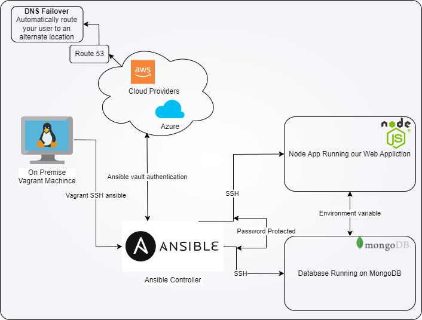

# Ansible and IaC

## Blue and Green Deployment

A blue/green deployment is a deployment strategy in which you create two separate, but identical environments. You then switch between the two environments, one at a time. This strategy is also known as a two-tier deployment.

## Iac with Ansible

### What is IaC?

Infrastructure as Code (IaC) is the process of managing and provisioning computer data centers through machine-readable definition files, rather than physical hardware configuration or interactive configuration tools.

### What is Ansible?

Ansible is an open-source software provisioning, configuration management, and application-deployment tool enabling infrastructure as code. It runs on many Unix-like systems, and can configure both Unix-like systems as well as Microsoft Windows.

### Benifits Ansible?

- **Agentless** - Ansible does not require any software or daemons to be installed on remote nodes. It uses SSH (or other remote communication protocols) for communication and does not leave any software or services running on remote nodes.

### IaC configuration Management

- **Configuration Management** - Ansible models your IT infrastructure by describing how all of your systems inter-relate, rather than just managing one system at a time. It tracks and manages changes, and can roll them back as needed.
