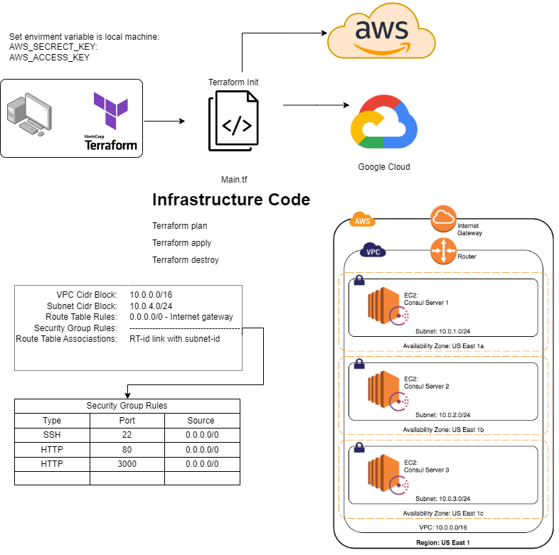

# Infrastructure as Code - Orchestration with Terraform

## What is Terraform?

Terraform is an open-source infrastructure as code software tool created by HashiCorp. Users define and provide data center infrastructure using a declarative configuration language known as HashiCorp Configuration Language, or optionally JSON.

## Benefits of Terraform

* **Infrastructure as Code** - Terraform codifies cloud APIs into declarative configuration files. Infrastructure is described using a high-level configuration syntax. This allows a blueprint of your data center to be versioned and treated as you would any other code. Additionally, infrastructure can be shared and re-used.

* **Execution Plans** - Terraform has a "planning" step where it generates an *execution plan*. The execution plan shows what Terraform will do when you call apply. This lets you avoid any surprises when Terraform manipulates infrastructure.

* **Resource Graph** - Terraform builds a graph of all your resources, and parallelizes the creation and modification of any non-dependent resources. Because of this, Terraform builds infrastructure as efficiently as possible, and operators get insight into dependencies in their infrastructure.

* **Change Automation** - Complex changesets can be applied to your infrastructure with minimal human interaction

## Terraform Use Cases

* **Provisioning** - Terraform can manage existing and popular service providers as well as custom in-house solutions.

* **Management** - Terraform can manage existing and popular service providers as well as custom in-house solutions.

* **Versioning** - Terraform codifies APIs into declarative configuration files that can be shared amongst team members, treated as code, edited, reviewed, and versioned.

* **Networking** - Terraform can model complex interdependent infrastructure resources.

* **Secrets Management** - Terraform can integrate with a variety of external data sources to pull in information that is sensitive, such as passwords or keys.

## Who uses Terraform?

* **Amazon**
* **Cisco**
* **Docker**
* **Google**
* **Microsoft**
* **Netflix**

## who owns it?

* **HashiCorp** - HashiCorp is a software company that develops open source tools for service discovery, secure configuration, and orchestration. The company's flagship product, Terraform, is a tool for building, changing, and versioning infrastructure safely and efficiently.

## Terraform Installation

Install Chocolatey

```bash
Set-ExecutionPolicy Bypass -Scope Process -Force; [System.Net.ServicePointManager]::SecurityProtocol = [System.Net.ServicePointManager]::SecurityProtocol -bor 3072; iex ((New-Object System.Net.WebClient).DownloadString('https://chocolatey.org/install.ps1'))
```

Install Terraform

```bash
choco install terraform
terraform --version
```

### Initialize Terraform

You can use the `terraform init` command to initialize a working directory containing Terraform configuration files.

### Terraform Plan

You can use the `terraform plan` command to create an execution plan. Terraform performs a refresh, unless explicitly disabled, and then determines what actions are necessary to achieve the desired state specified in the configuration files.

### Terraform Validate

You can use the `terraform validate` command to validate the configuration files in a directory, referring only to the configuration and not accessing any remote services such as remote state, provider APIs, etc.

### Terraform Apply

You can use the `terraform apply` command to apply the changes required to reach the desired state of the configuration, or the pre-determined set of actions generated by a `terraform plan` execution plan.

### Terraform Destroy

You can use the `terraform destroy` command to destroy the Terraform-managed infrastructure.

### Terraform Resources

Resources are the most important part of Terraform. Resources are the components that make up your infrastructure. For example, a virtual machine, a load balancer, a DNS record, or a database.

## Terraform Setup



### Create a folder called `eng130_terraform` and add the following content

```bash
cd eng130_terraform
nano main.tf
```

### Create an EC2 Instance

Edit the file `main.tf`

```json
provider "aws" {
  region = "eu-west-1"
}

resource "aws_instance" "example" {
  ami           = "ami-0c55b159cbfafe1f0"
  instance_type = "t2.micro"
}
```

### Create a VPC

Edit the file `main.tf`

```json
provider "aws" {
  region = "eu-west-1"
}

resource "aws_vpc" "example" {
  cidr_block = "10.0.0.0/16"
  instance_tenancy = "default"

  tags = {
    Name = "eng130_aneese_my_vpc_terraform"
  }
}
```

### Create a Subnet

Edit the file `main.tf`

```json

resource "aws_vpc" "example" {
  vpc_id = aws_vpc.eng130_aneese_my_vpc_terraform.id
  cidr_block = "10.0.4.0/24"
  availability_zone = "eu-west-1a"
  map_public_ip_on_launch = "true"
  
  tags = {
    Name = "eng130_aneese_subnet"
  }
  
}
```

### Create a Security Group

Edit the file `main.tf`

```json
resource "aws_security_group" "eng130_sg"{
  name = "eng130_sg"
  description = "eng130_sg"
  vpc_id = aws_vpc.eng130_aneese_my_vpc_terraform.id

    //Inbound Rules
    ingress {
        description = "SSH"
        from_port = 22
        to_port = 22
        protocol = "tcp"
        cidr_blocks = ["0.0.0.0/0"]
    }
    //Outbound Rules
    egress {
        from_port = 0
        to_port = 0
        protocol = "-1"
        cidr_blocks = ["0.0.0.0/0"]
        }
    }
```

### Create an internet gateway

Edit the file `main.tf`

```json

resource "aws_internet_gateway" "eng130_igw" {
  vpc_id = aws_vpc.eng130_my_vpc.id

  tags = {
    Name = "eng130_igw"
  }
}
```

### Create a Route Table

Edit the file `main.tf`

```json
resource "aws_route_table" "eng130_rt" {
  vpc_id = aws_vpc.eng130_my_vpc.id

  route {
    cidr_block = "0.0.0.0/0"
    gateway_id = aws_internet_gateway.eng130_igw.id
    }
}
```

### Create a Route Table Association

Edit the file `main.tf`

```json
resource "aws_route_table_association" "eng130_rta" {
  subnet_id      = aws_subnet.eng130_subnet.id
  route_table_id = aws_route_table.eng130_rt.id
}
```
